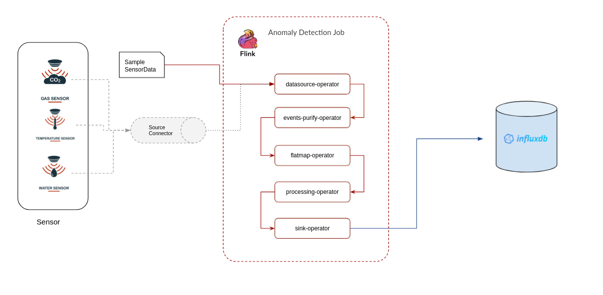
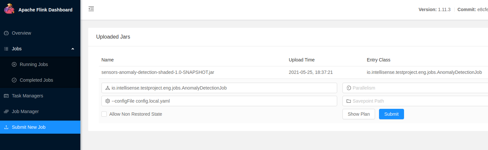

# Project  Solution :

How to run the project 



Before Execution

Step 01 : 
```$xslt
git clone https://gitlab.com/IntelliSenseIO/public/testproject.eng.backend.git

cd testproject.eng.backend
```

Step 02 
```$xslt
mvn clean package
```
Step 03 
```$xslt
docker-compose up -d
```

Make sure all environments are up and running. Then follow the execution methods you prefer.

Execution Steps

1. Command Line Excution
```
$ ./bin/flink run \
      --detached \
      ./testproject.eng.backend/target/sensors-anomaly-detection-1.0-SNAPSHOT-shaded.jar
      --configFile config.local.yaml -sensorData <DATAFILE>
```
2. Web UI execution





